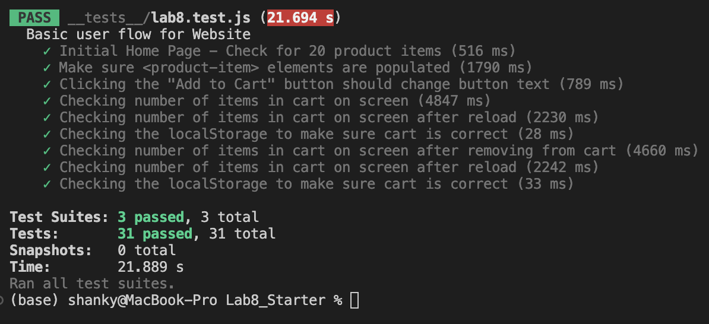

# Lab 8 - Starter

Responding to question 1, you should fit automated testing within a github action that runs whenever code is pushed, since that allows for incremental development to recieve feedback on every advance, to ensure that no prior functionality breaks nor current functionality failing to cover all cases tested.

Responding to question 2, you would not use end to end tests to check if a function is returning the correct output, for a smaller unit like a function you would use a unit test.

Responding to question 3, you would not use a unit test since this is more of an end to end test since it is accross the system from one user to another

Responding to question 4, you would use a unit test since blocking messages over a certain character length is a unit piece code and not accross the system.

